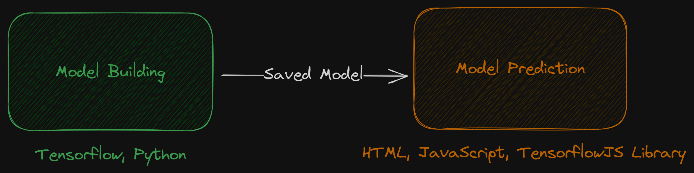
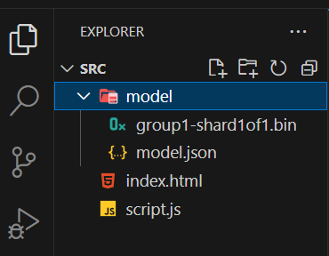

# 259106: Workshop Technology

---

# AI-powered Web Application

## Cloth Size Prediction

---

# Technology

- Machine learning
  - Tensorflow library
  - Python language
- Web application
  - HTML
  - JavaScript

---

---

# Artificial Neural Networks (ANN)

- Algorithms based on brain function and are used to model complicated patterns and forecast issues.

- ANN can be best viewed as weighted directed graphs, that are commonly organized in layers.

---

---

# Let's build ANN to predict cloth size.

---

# Data

- https://raw.githubusercontent.com/it-for-ie-66/tf_dev/main/src/T04%20-%20Cloth/data_sampled.csv
  - This data was adapted from [Source - Kaggle](https://www.kaggle.com/datasets/tourist55/clothessizeprediction).

---

# Machine learning code

- https://colab.research.google.com/drive/1QSs0VHlb3djvZfI_D5_PelAGcmlT80L3?usp=sharing
- You should obtain the saved model (zip).

---

# Let's build a web application to make prediction.

---

# File structure

---

- `index.html`

  - https://gist.github.com/nnnpooh/7ae7c88ac6ae7152c6469eca16282a2b#file-index-html

- `script.js`
  - https://gist.github.com/nnnpooh/7ae7c88ac6ae7152c6469eca16282a2b#file-script-js

---

# Deployment

https://www.netlify.com/
